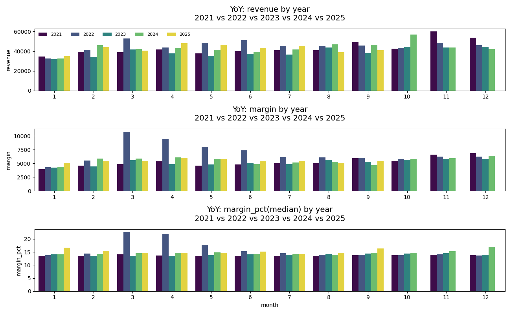
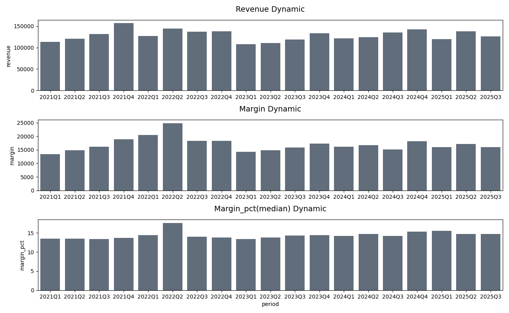

# b2b-sales-analytics
B2B Sales Analytics (2021–2025)

Analysis of B2B sales performance for a single company over a 4.5-year period (Jan 2021 – Sep 2025): from raw database exploration to a cleaned, analysis-ready dataset and revenue/margin trend analysis.

Stack: SQL · Python (pandas, NumPy) · Parquet · Matplotlib/Seaborn

Table of Contents
Project Overview
Data & Anonymization
Project Structure
01 — Database Exploration
02 — Data Extraction & Loading
03 — Data Reading & Pre-Aggregation
04 — Exploratory Data Analysis
Key Findings
Next Steps
How to Run
Project Overview

This project analyzes real B2B sales transactions from a single company, covering January 2021 through September 2025. The raw data follows a period → manager → client → order → revenue hierarchy; this analysis focuses on the aggregate revenue and margin trends over time, without SKU-level detail.

Business questions answered:

How have total revenue, total margin, and margin % evolved year over year?
How do revenue, margin, and margin % trend at a quarterly level?
Data & Anonymization

The underlying data comes from a real company's transactional database (1C Enterprise / PostgreSQL) and has been anonymized before publication:

manager_id and client_id are original 1C-generated GUIDs, replaced with a salted HMAC-SHA256 hash (truncated hex). The mapping is deterministic, so any grouping remains internally consistent — but original identities cannot be recovered.
The salt used for hashing is kept outside the repository (not committed).
No client names, manager names, contact details, or other identifying fields are included anywhere in the repository.

SKU-level detail was deliberately excluded — this analysis focuses on overall revenue and margin dynamics, not product mix.

Project Structure
```
├── 01db_exploring/   # exploring the source schema, keys, table relationships
├── 02data_load/      # SQL extraction from the source DB, saved as Parquet
├── 03data_read/      # reading Parquet, pre-aggregation, saved locally
├── 04eda/
│   └── eda01_intro     # duplicate/missing-value checks, anonymization of sensitive fields
├── results.txt
└── README.md
```

📂 01db_exploring/

Explored the source database schema behind the company's 1C Enterprise system to identify the relevant tables, keys, and relationships needed for the analysis.

02 — Data Extraction & Loading

📂 02data_load/

Extracted the relevant data via SQL and saved it locally in Parquet format for efficient, reproducible downstream processing.

03 — Data Reading & Pre-Aggregation

📂 03data_read/

Read the Parquet files, performed initial aggregation, and saved the resulting dataset locally for the analysis stage.

# 04 — Exploratory Data Analysis

📂 04eda/ · eda01_intro

Checked for duplicate records and missing values
Anonymized sensitive fields (manager and client identifiers — see Data & Anonymization)
Analyzed revenue, margin, and margin % trends at two levels of granularity:


Fig. 1 — Year-over-year total revenue, total margin, and median margin %.


Fig. 2 — Quarterly total revenue, total margin, and median margin %.

How to Run
bash
git clone https://github.com/dgdata21/b2b-sales-analytics.git
cd b2b-sales-analytics
pip install -r requirements.txt
jupyter notebook
